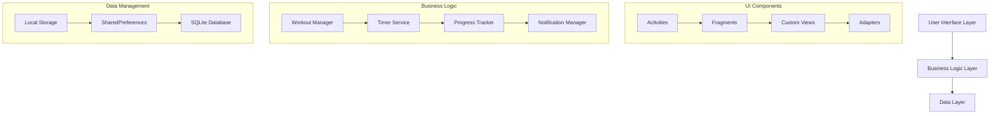
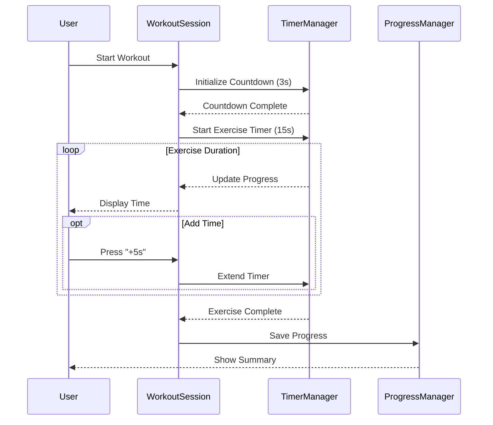
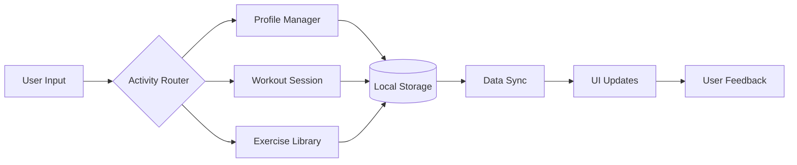

# Fitness Tracker App


A comprehensive fitness tracking Android application built with Java, featuring workout management, profile customization, and activity tracking. Compatible with Android 7.0 (API 24) and above.

## Features
- 🏋️ Guided Workout Sessions
  - Countdown timer (3-2-1)
  - 15-second exercise intervals
  - "+5s" time extension
  - Progress tracking
  - Pause/Resume functionality
- 📊 Activity Dashboard
  - Daily/weekly statistics
  - Progress visualization
  - Achievement tracking
- 👤 User Profile Management
  - Customizable user details
  - Dark theme support
  - Progress history
- 📚 Exercise Library
  - Categorized exercises
  - Detailed instructions
  - Custom workout creation
- 🔔 Smart Notifications
  - Workout reminders
  - Progress updates
  - Achievement alerts

## Architecture



## Component Interaction Flow



## Data Flow Architecture



## Setup and Installation
1. Clone the repository
2. Open in Android Studio (Giraffe or newer recommended)
3. Sync Gradle dependencies
4. Build the project using:
   ```bash
   ./gradlew clean build
   ```
5. Install the generated APK from `app/build/outputs/apk/release/`

## Project Structure
```
app/
├── src/
│   ├── main/
│   │   ├── java/
│   │   │   └── com/example/fitnesstracker/
│   │   │       ├── activities/
│   │   │       ├── adapters/
│   │   │       ├── models/
│   │   │       ├── services/
│   │   │       └── utils/
│   │   ├── res/
│   │   │   ├── layout/
│   │   │   ├── values/
│   │   │   └── drawable/
│   │   └── AndroidManifest.xml
│   └── test/
└── build.gradle
```

## Key Components

### WorkoutSession
- Manages exercise flow
- Handles countdown and exercise timers
- Processes user interactions
- Updates progress UI

### Profile Management
- User data storage
- Theme preferences
- Progress tracking
- Achievement system

### Exercise Library
- Exercise categories
- Detailed instructions
- Custom workout creation
- Progress tracking

## Theme Support
- Light and Dark theme
- Material Design components
- Consistent styling
- Adaptive layouts

## Performance Considerations
- Efficient timer implementation
- Optimized data storage
- Responsive UI updates
- Battery-friendly background services

## Future Enhancements
- Heart rate sensor integration
- Cloud data sync
- Social features
- Advanced analytics

## Contributing
1. Fork the repository
2. Create a feature branch
3. Commit changes
4. Push to the branch
5. Open a Pull Request

## License
This project is licensed under the MIT License - see the LICENSE file for details.
